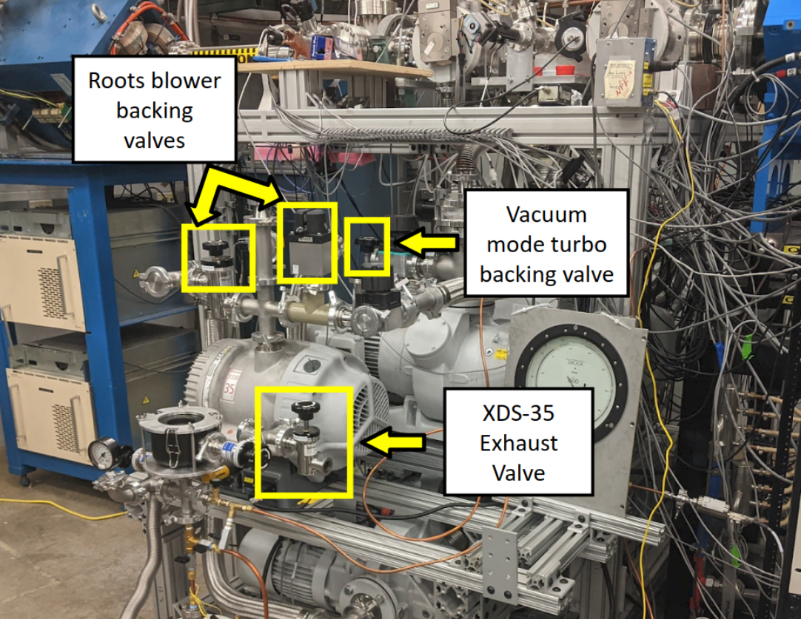

HIPPO Operation
===============

.. note::

   Some of the photos here are outdated, but the process generally remains the same. 

.. note::

   **!!!PRO TIP ALERT!!!** If you click on the links to view the referenced figures, if you go "back" in whatever browser you are in, you will be directed back to where you were.

Vacuum operation
----------------
Starting with HIPPO mechanically closed but at atmospheric pressure, the pumping operation is as follows:

.. _target to image:

.. figure:: /img/logo.png
   :alt: Logo
   :align: center
   :width: 240px

   Link me!

blah blah :numref:`target to image`
blah blah :numref:`hippo1`

#. Close the nitrogen vent valve (:numref:`hippo1`. ).
#. Ensure the XDS35 pump exhaust valve to atmosphere is open (:numref:`hippo2`).
#. Ensure the XDS35 pump is ON (:numref:`hippo3`).
#. Depending on the status of other sections of St. George and the 5U beam line:

   * Close the beam line gate valve at the wall before the quad triplet (:numref:`hippo4`).
   * Close the beam line gate valve between Q2 and B1 (:numref:`hippo5`).
   * This isolates HIPPO from the rest of the beamline (:numref:`hippo6`).

#. Gently open the vacuum operation turbo backing valve (:numref:`hippo2`) on top of the XDS35 pump.

   * Gradually open the valve until fully open as the pump sound improves.

#. Check that the vacuum readings on CG2 gauges 1-4 (see :numref:`hippo7` and the hornet gauge guide) are decreasing.

   * If not, there may be a problem such as leaks or components not being closed properly.

#. Turn on the 4 hornet IGs and verify they indicate activity after 5-10 seconds (:numref:`hippo7`).

#. When CG2 readings on the gauges reach approximately 1E-1 mbar or better, turn on the 5 turbo pumps using LabVIEW on the console (Photo 16).

   * The LabVIEW code for this operation is located on the St. George control terminal and can be found in XXX.

#. The vacuum as indicated by the four ion gauges on LabVIEW should reach better than ~5x10-5 mbar within 2-3 minutes.

#. Done.

Going from vacuum mode to jet operation
---------------------------------------
**Review the whole procedure before proceeding**. This procedure starts assuming vacuum mode operation with the recirculation side fully separated from HIPPO, i.e., Jet valve (:numref:`hippo8`) closed, recirculation valve (:numref:`hippo8`) closed, and XDS35 exhaust valve (:numref:`hippo2`) opened to atmosphere.

#. Close the two beam line gate valves:

   * The one at the wall before the quad triplet (:numref:`hippo4`).
   * The one between Q2 and B1 (:numref:`hippo5`).
   * This isolates HIPPO from the rest of St. George (:numref:`hippo6`).

#. Make sure the HIPPO collimator is fully retracted.

#. Pump the recirculation side:

   * Turn XDS 10 pump ON (:numref:`hippo3`).
   * Open the two XD9S10 pumping valves (:numref:`hippo8`).
   * Wait for the vacuum in the recirculation area, as read on the LabVIEW (or Hornet 2 CG1), to reach below ~2E-2 mbar.

#. If the sorption pump (:numref:`hippo3`) is to be used:

   * Open the two valves on the sorption pump (:numref:`hippo9`).
   * Wait for the vacuum in the recirculation area, as read on the LabVIEW (or Hornet 2 CG1), to reach below ~2E-2 mbar.
   * You can move ahead while the vacuum is going down.

#. Open the regulator and the exit valve at the helium bottle (:numref:`hippo10`) on the wall to the right of “Door 10”. The regulator should indicate pressure left in the bottle; the exit pressure gauge should be between 45 and 60 PSI. Pay attention that there is also a nitrogen bottle.

#. At the panel on the wall, turn the power to the roots-blower ON (:numref:`hippo11`).

#. Purge the helium line by opening the helium purging valve for 3-5 seconds (:numref:`hippo9`).

#. Close the vacuum mode backing of the turbo pumps valve (:numref:`hippo2`).

#. Open the two backing of the roots-blower valve (:numref:`hippo2`).

#. Turn the 5 roots blower ON on the LabVIEW.

:numref:`hippo1`

#. Open the backing of the turbo Jet mode valve (:numref:`hippo12`).

#. On the LabVIEW, ensure the vacuum is OK:
   * Must read better than:
     - ~1-3E-3 mbar or better on turbo backing.
     - ~1E-4 mbar on top of the roots blower backing the turbo.
     - ~6E-3 mbar on top of roots blower backing the chamber.
     - ~5E-3 mbar on top of roots blower backing the catcher.
     - ~2E-3 mbar between the roots blower.
     - ~1E-2 mbar on top of the XDS35 pump.

#. Switch the Chamber and Catcher gate valve controller to “override” mode (:numref:`hippo13`).

#. Open the chamber and catcher gate valve (:numref:`hippo13`).

   - If the two sorption pump valves (:numref:`hippo9`) are open, close them.

#. Close the XDS35 exhaust valve (:numref:`hippo2`).

#. Quickly open the recirculation valve (:numref:`hippo8`).

   - The XDS10 will pump the small volume coming from the exit of the XDS35; you’ll hear the pump.

#. Wait for recirculation vacuum (on the LabVIEW or Hornet 2 CG1) to go down to ~8E-2 mbar or better.

#. Close the two XDS10 pumping valves (:numref:`hippo8`).

#. Open the Jet valve (:numref:`hippo8`).

#. Very gently open the Helium intake valve (:numref:`hippo9`), keeping an eye on the baratron gauge value (:numref:`hippo14`).

#. You could use one of the XDS10 pumping valves (:numref:`hippo8`) to remove the helium for a preliminary purge if desired.

#. If you plan to use the compressor:

   * Inject at least ~200 mbar, but no more than ~500 mbar, before starting the compressor.
   * When ~200-400 mbar is reached, close Helium intake valve (:numref:`hippo9`) and turn the compressor ON (:numref:`hippo15`).

#. Use the Helium intake valve (:numref:`hippo9`) and one of the XDS10 pumping valves (:numref:`hippo8`) to reach the desired injection pressure.

#. This should be it.

   * If purging is needed, turn the compressor off (:numref:`hippo15`), open the XDS10 pumping valve (:numref:`hippo8`), and go to point 17 and proceed.
   * Make sure that if you plan to inject Helium, you close the two beam line gate valves as described in point 1.

#. Done.

Going from jet mode to vacuum operation
---------------------------------------
This procedure starts assuming the Jet is in recirculation mode.

#. Close the two beam line gate valves:

   * The one at the wall before the quad triplet (:numref:`hippo4`).
   * The one between Q2 and B1 (:numref:`hippo5`).
   * This isolates HIPPO from the rest of St. George (:numref:`hippo6`).

#. If using, turn the compressor off (:numref:`hippo15`).

#. Open one of the XDS10 pumping valves (:numref:`hippo8`) to remove the helium.

#. Close the Jet valve (:numref:`hippo8`).

#. When the vacuum in the recirculation zone, as read on the LabVIEW (or Hornet 2 CG1), reaches ~1E-1 mbar:

   * Close the recirculation valve (:numref:`hippo8`).
   * Quickly open the XDS35 exhaust valve (:numref:`hippo2`).

#. Close the chamber and catcher gate valve (:numref:`hippo13`).

#. Remove the chamber and catcher gate valve override (:numref:`hippo13`).

#. Close the Jet mode turbo backing (:numref:`hippo12`).

#. Stop the 5 roots-blower in the LabVIEW.

#. Close the two roots-blower backing valves (:numref:`hippo2`).

#. Open the vacuum mode turbo backing valve (:numref:`hippo2`).

#. To keep the recirculation zone under decent vacuum, open the second XDS10 pumping valve (:numref:`hippo8`).

#. Close the Helium bottle (:numref:`hippo10`), both the regulator and the exit valve.

#. If the roots blower are at a temperature (close to the motor of the biggest one) at which you can leave your hand on:

   * Shutdown the power to the roots blower on the wall panel (:numref:`hippo11`).
   * If not, leave it overnight before shutting the power off.

#. Done.

Venting HIPPO to atmosphere 
---------------------------
#. Close the vacuum mode turbo valve (:numref:`hippo2`).

#. Turn off all 5 turbo pumps (Photo XXX).

#. Turn off ion gauges on all 4 hornets:

   * Press menu then hit enter on IG OFF (Photo XXX).

#. Inject some nitrogen into the compressed gas line (Photo XXX).

   * If gas does not come out of the purging line, make sure the HIPPO valve between the zero degree and solid target lines is open.

#. Turn the nitrogen vent valve SLOWLY until CG2 on Hornet 2 reaches ~3E-1 mbar, then close the vent valve.

#. Go to the St. George console and open up the pressure reading LabVIEW (Photo XXX) to watch the turbos spin down.

#. Once turbo speeds are down to ~0-20, slowly inject more nitrogen until you reach ~900 mbar on Hornet 2 CG2.

#. At 900 mbar, loosen the flange on top of HIPPO in the picture (Photo XXX), but do NOT remove the valve.

#. At ~1E3 mbar, tilt the gauge slightly. If you feel air flowing OUT, then you can close the venting valve, and HIPPO has been vented.

Hornet Gauge Guide
------------------

.. list-table:: **Hornet 1**
   :widths: 25 25
   :header-rows: 1

   * - Readout
     - What it is reading
   * - IG
     - Upstream of cube 1
   * - CG1
     - Output of roots blower
   * - CG2
     - Entrance of XDS35 pump
  
.. list-table:: **Hornet 2**
   :widths: 25 25
   :header-rows: 1

   * - Readout
     - What it is reading
   * - IG
     - Downstream of cube 1
   * - CG1
     - Exit of XDS35 (recirculation side)
   * - CG2
     - Side chamber

.. list-table:: **Hornet 3**
   :widths: 25 25
   :header-rows: 1

   * - Readout
     - What it is reading
   * - IG
     - Upstream of cube 2
   * - CG1
     - Backing of 5 turbo pumps (recirculation side)
   * - CG2
     - Central chamber

.. list-table:: **Hornet 4**
   :widths: 25 25
   :header-rows: 1

   * - Readout
     - What it is reading
   * - IG
     - Downstream of cube 2
   * - CG1
     - Exit of jet
   * - CG2
     - Backing of turbos

.. _hippo1:

  Location of nitrogen vent and purge valves on beam left.

.. _hippo2:

   Beam right.

.. _hippo3:

   The location of the XDS-35, XDS-10, and sorption pumps at HIPPO beam right.

.. _hippo4:

   Location of the button for the gate valve between the switching magnet and HIPPO.

.. _hippo5:

   Location of the button for the gate valve between Q2 and B1.

.. _hippo6:

.. figure:: images/hippo/hippo5.PNG

   The two gate valves isolate HIPPO from the beamline while switching to different modes of operation. 

.. _hippo7:

   The 4 hornet gauges on top of HIPPO

.. _hippo8:

   Beam right.

.. _hippo9:

   The location of the sorption pump valves and helium valves on beam right.

.. _hippo10:

   Valves and dials for the helium gas supply.

.. _hippo11:

   The roots blower power supply switch on the wall behind HIPPO.

.. _hippo12:

   The location of the Jet mode turbo backing valve at HIPPO beam left.

.. _hippo13:

.. figure:: images/hippo/hippo12.PNG

   The location of the catcher and chamber override switches and their gate valve controls.

.. _hippo14:

   The top baratron gauge is where you will look when opening the helium intake valve, it gives a readback of the injection pressure. Make sure it is set to CH1.

.. _hippo15:

   The location of the compressor and its power switch. The switch is kinda hidden behind some things, so the zom in should help you find it.

