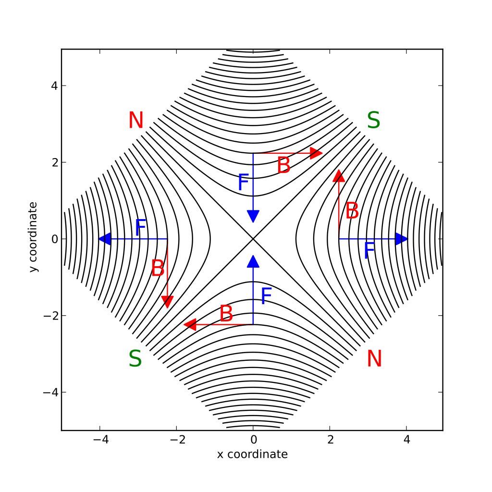

General Information
===================
This section is primarily meant to provide a description for the various elements on St. George, or common terms that we may use. 

.. _whatis:

What is St. George?
------------
The Strong Gradient Electromagnetic Online Recoil separator for capture
Gamma Ray Experiment, or St. George is a recoil mass separator located at the University of Notre Dame. The main goal of St. George is to measure (:math:`\alpha` , :math:`\gamma`). reactions that are important for astrophysical processes. Recoil separators are complicated machines, so hopefully this explains some of the elements on St. George well enough for you to understand what is going on.

Dipole Magnets
------------

The St. George Dipole magnets are responsible for the charge state selection of the recoils after being created in the HIPPO gas target. In analogy with traditional optics, a dipole magnet seperates particles by p/q much like a prism seperates light by wavelength.

.. math::

   F = ma = \frac{mv^2}{\rho} 

.. math::
   F = qvB 

.. math::
   qvB = \frac{mv^2}{\rho} 

.. math::
   B\rho = \frac{p}{q} 

where :math:`\rho` is the bending radius of the dipole magnet. I find the most useful interpretation of :math:`B\rho` to be how "hard" it is to bend a particle around the dipole. A particle with a higher :math:`B\rho` is harder moving faster and harder to bend, and a particle with lower :math:`B\rho` is moving more slowly and easier to bend. A diagram of this is shown below, with the main idea that we want to tune the dipoles to such that the most probable charge state of the recoils goes down the center of the beampipe.

.. figure:: images/brho.png
    :width: 400
    :align: center

    Diagram showing the impact of :math:`B\rho` on the trajectory of a charged particle in a dipole magnet.

Quadrupole Magnets
------------
In addition to the 6 dipole magnets, St. George also has 11 quadrupole magnets for focusing and defocusing the beam. The important thing to remember about quadrupole magnets is that if the quadrupole focuses in one direction, lets say in the x direction, it defocuses in the other direction.  It is for this reason that in every application I can think of, quadrupole magnets come in pairs or even triplets. 

    Diagram showing that a quadrupole magnet will be focusing in one axis, and defocusing in the other. This assumes a positively charged beam travelling into the screen.

Wien Filter
------------
The Wien filter is the location where the majority of the rejection of the primary beam takes place. We set the fields of a perpendicular electric and magnetic field to tune the Wien filter to only allow particles of a specific velocity through. Luckily this effect is easily explainable with only a semester (maybe) of electromagnetism. 

.. math::

   F_B = qvB = \frac{mv^2}{\rho} \rightarrow B\rho = \frac{p}{q} 

.. math::

   F_E = qE = \frac{mv^2}{\rho} \rightarrow E\rho = \frac{p}{q}v 

.. math::

   v = \frac{E\rho}{B\rho} 

  
Recycling
--------
"Recycling" of the magnets is required any time we need to set a magnet to a higher field than it currently is at. The reason for this is the effect of hysteresis on the magnetic field of the magnets. 

Misc Terms
------------
+ **Beam left/beam right:** left or right as seen by the beam travelling through St. George. 
+ **Rejection:** 

