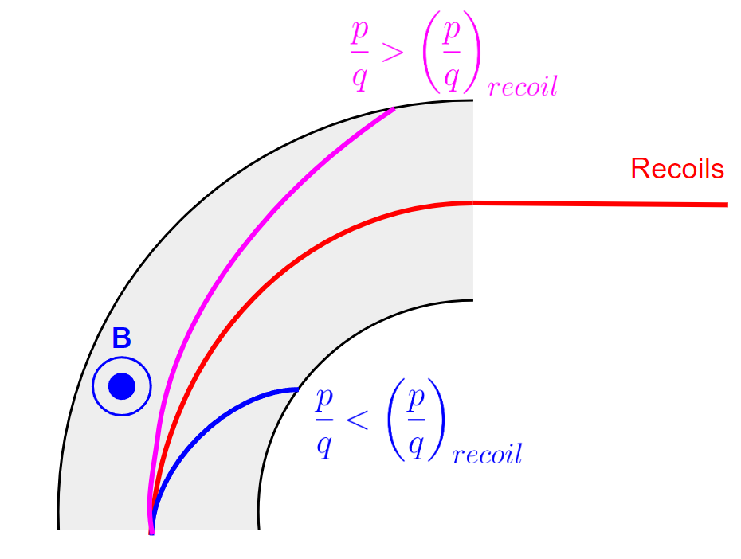

General Information
===================
This section is primarily meant to provide a description for the various elements on St. George, or common terms that we may use. 

.. _whatis:

What is St. George?
------------
The Strong Gradient Electromagnetic Online Recoil separator for capture
Gamma Ray Experiment, or St. George is a recoil mass separator located at the University of Notre Dame. The main goal of St. George is to measure (:math:`\alpha` , :math:`\gamma`). reactions that are important for astrophysical processes. Recoil separators are complicated machines, so hopefully this explains some of the elements on St. George well enough for you to understand what is going on.

Dipole Magnets
------------

The St. George Dipole magnets are responsible for the charge state selection of the recoils after being created in the HIPPO gas target. In analogy with traditional optics, a dipole magnet seperates particles by p/q much like a prism seperates light by wavelength.

.. math::

   F = ma = \frac{mv^2}{\rho}
   F = qvB
   qvB = \frac{mv^2}{\rho}
   B\rho = \frac{p}{q}

Quadrupole Magnets
------------
In addition to the 6 dipole magnets, St. George also has 11 quadrupole magnets for focusing and defocusing the beam. The important thing to remember about quadrupole magnets is that if the quadrupole focuses in one direction, lets say in the x direction, it defocuses in the other direction.  It is for this reason that in every application I can think of, quadrupole magnets come in pairs or even triplets. 

Wien Filter
------------
The Wien filter is the location where the majority of the rejection of the primary beam takes place. We set the fields of a perpendicular electric and magnetic field to tune the Wien filter to only allow particles of a specific velocity through. Luckily this effect is easily explainable with only a semester (maybe) of electromagnetism. 

Misc Terms
------------
*test:*
