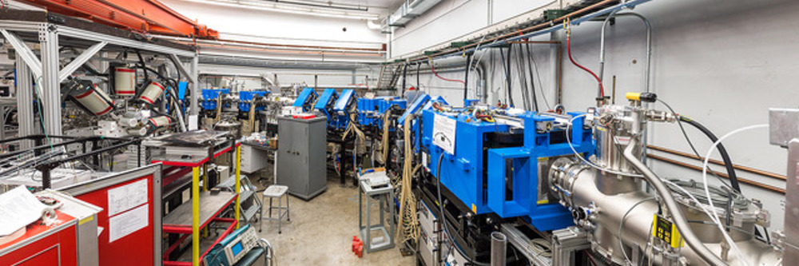

Welcome to the St. George How to Guide!
===================================

**St. George** is the recoil mass separator located at the University of Notre Dame. This documentation is meant to serve as both a guide and a reminder for some of the typical operations of St. George. This guide will follow the general format: 

#. General St. George information
#. St. George Operation
.. #. Energy Change Procedure 
#. HIPPO Guide
#. Data retrieval and conversion

.. note::

   This project is under active development.

Contents
--------

.. toctree::

   generalinfo

   tuningprocedure
   stgoperation
   stg magnet control operation
   wfoperation
   cup current recording

   .. energyprocedure
   
   

   HIPPOoperation

   dataaq
   retrieving data from stgdaq
   spectcl operation
   pressure recording

   referenceimages
