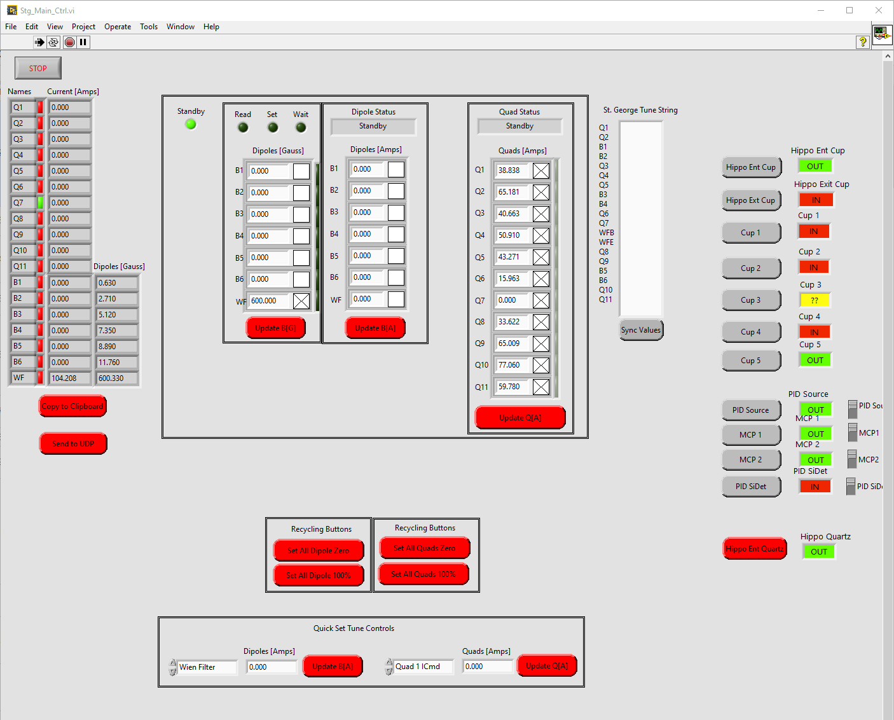
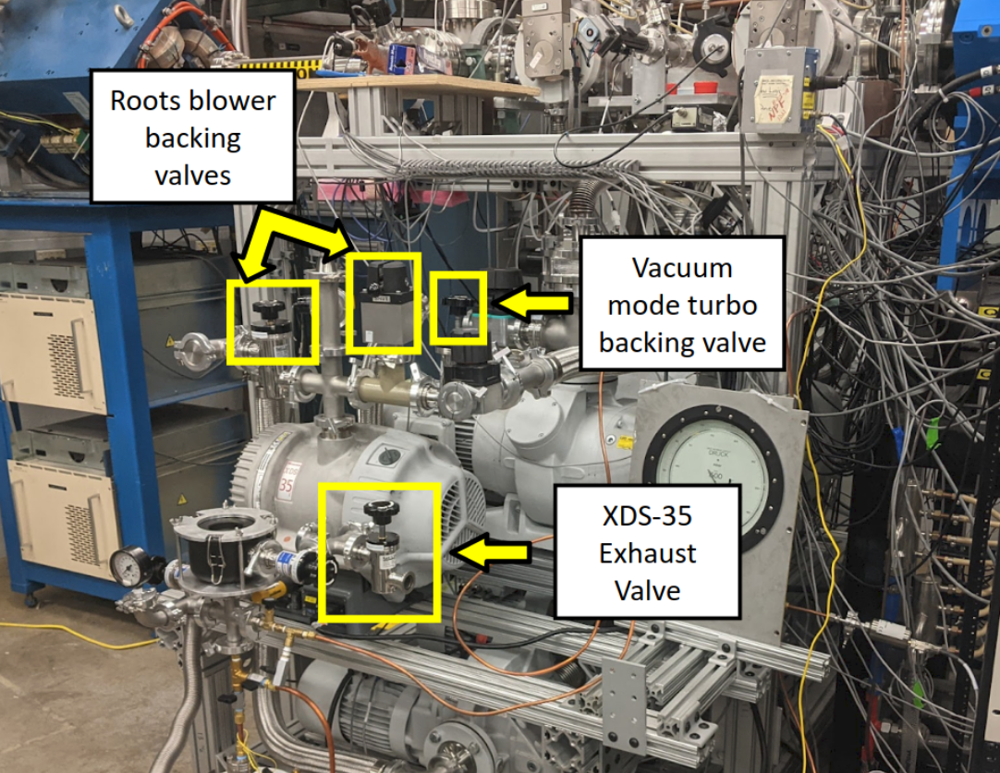

St. George Operation
====================

.. _whatis:

St. George Magnet Controls
--------------------------

.. _stgmagcontrols:

   :alt: Logo
   :align: center
   :width: 240px

   caption

blah blah :numref:`stgmagcontrols`
blah blah :numref:`hippo1`

Wien Filter Operation
---------------------

This is a short guide on how to operate the St. George Wien filter (WF). Information about what the WF is and what is does can be found `here <generalinfo.rst>`_.

Opening WF controls
~~~~~~~~~~~~~~~~~~
On the St. George computer at the 5U console,

WF controls
~~~~~~~~~~~~~~~~~~

WF conditioning
~~~~~~~~~~~~~~~~~~
Conditioning the WF is the process of bringing the voltage up above where we will have it set during an experiment so that we can get rid of anything in the WF that may cause stability issues at higher voltages, whether it be slight scratches on the surface of the chamber, or some stray dust. The point of conditioning is to create small instabilities in the WF to get rid of these issues and prevent the WF from sparking down to 0V during an experiment. The way we do this is by slowly increasing the current until we see the machine struggle a bit to reach the set voltages. Once you see this happen, give the WF a minute or two to reach the set voltage before continuing. You may need to increase the current being supplied to the power supplies to something like 3-4 :math:`\muA` during this procedure.

What to do in case of a spark
~~~~~~~~~~~~~~~~~~
If you notice a spark in the WF the steps are as follows:

#. Immediately put in the HIPPO entrance cup using the Stg Magnet control panel. 
#. Press the **SET Pos DC** and **SET Neg DC** buttons to stop the WF from immediately trying to go back up to the set voltage.
#. Set the negative and positive power supplies to zero and press **SET BOTH POWER SUPPLIES** button. 
#. Press the **SET Pos DC** and **SET Neg DC** buttons again. 
#. Wait a minute or two and then bring WF up to required voltage while keeping an eye on the stability.

.. _hippo1:

   Caption for the figure.

blah blah :numref:`stgmagcontrols`

Cup Current Recording
---------------------

Quartz Viewing
---------------------
.. note::

   **Make sure to bias down Si detector and MCPs before sending the beam to the detector chamber quartz**

Sending Beam to Si detector
---------------------------
.. note::

   **Pay close attention to this section unless you want to be reason that an experiment ends prematurely :)**

