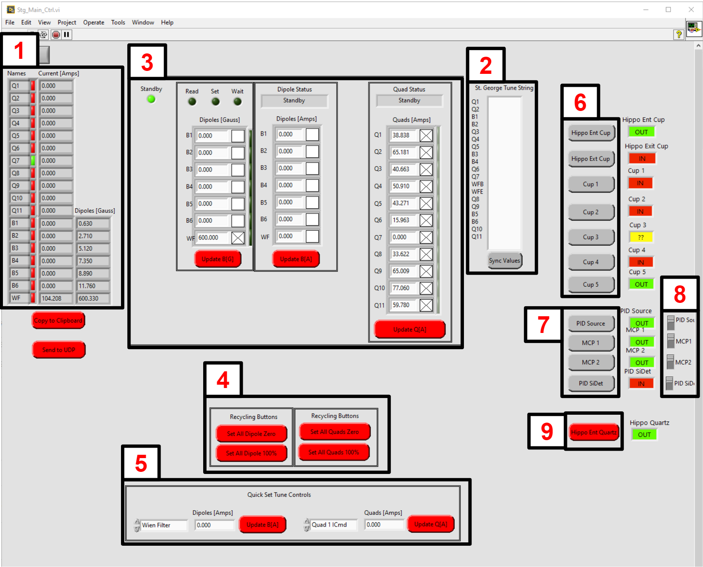

St. George Operation
====================

.. _whatis:

Labview Programs
----------------
There are several labview programs we will use in the operation of St. George. On the St. George computer at the 5U console area, there is a :code:`St George` folder that will contain the labview programs we need. The two we need for directly controlling St. George are 

* StG_Main_Ctrl.vi
* wienFilterMonito_Fry_v3.vi

The first interface is for controlling the current/field of the various magnets on St. George and for the control of faraday cups along the St. George beamline. The second program is for controlling the electric field of the Wien filter.

St. George Magnet Controls
--------------------------
When you open up the labview interface :code:`StG_Main_Ctrl.vi` you should see something like this:

.. _stgmagcontrols:

   St. George Magnet and cup control program

There is a lot to take in here so lets break everything down. Starting on the left, you have the current readback for all of the magnets Q1-Q11 (quadrupoles), B1-B6 (dipoles), and the Wien filter magnet. For the dipoles and the wien filter you also get a readback of the magnetic field in Gauss as well. This is where you will want to be checking to make sure values have been updated properly from other sections of the control program. 

In the middle is where we update the magnets with values we have from the St. George tuning sheet. From the tuning sheet we copy and paste the values we wish to set the magnets to in the "St George Tune String" box and press sync values. This will update the other fields in the center with the values we just synced. If the element has a X in the box next to it, when you press the update buttons the program will bring those elements to the setpoint values. If you watch the current/field readouts on the left you will notice the values change. If you are bringing any of the elements to a value that is higher than it is currently at, the program automatically recycles the element. 

On the bottom middle there are buttons to manually recycle all of the dipoles and quadrupoles. There is also a set of controls to manually adjust the current for any of the elements as well.

Finally on the right we have the controls for moving various elements in and out of the beamline. The order from top to bottom follows from the beginning of St. George to the end. Look `here <refernceimages.rst>`_. for the locations of the various cups. The only cups not indicated are the HIPPO entrance and exit cups, but it should be fairly clear as to where those are, and cup 5 which is in the detectoro chamber between MCP1 and MCP2. The PID source is a weak alpha source from a fire alarm that is always in the detection chamber and is used to verify the signals on the MCPs. 

There is an additional step required to put elements within the detection chamber into position to take data. There are switches that must be activated to allow you to drive the MCPs and Si detector into the soon-to-be beam path. This is to prevent accidentally putting them in harms way when tuning or something.

blah blah :numref:`stgmagcontrols`

Wien Filter Operation
---------------------

This is a short guide on how to operate the St. George Wien filter (WF). Information about what the WF is and what is does can be found `here <generalinfo.rst>`_.

Opening WF controls
~~~~~~~~~~~~~~~~~~
Once you upen up the labview interface :code:`wienFilterMonito_Fry_v3.vi` you should see something like this:

.. _wfcontrols:

   St. George Wien filter electric field control

WF controls
~~~~~~~~~~~~~~~~~~

WF conditioning
~~~~~~~~~~~~~~~~~~
Conditioning the WF is the process of bringing the voltage up above where we will have it set during an experiment so that we can get rid of anything in the WF that may cause stability issues at higher voltages, whether it be slight scratches on the surface of the chamber, or some stray dust. The point of conditioning is to create small instabilities in the WF to get rid of these issues and prevent the WF from sparking down to 0V during an experiment. The way we do this is by slowly increasing the current until we see the machine struggle a bit to reach the set voltages. Once you see this happen, give the WF a minute or two to reach the set voltage before continuing. You may need to increase the current being supplied to the power supplies to something like 3-4 :math:`\muA` during this procedure.

What to do in case of a spark
~~~~~~~~~~~~~~~~~~
If you notice a spark in the WF the steps are as follows:

#. Immediately put in the HIPPO entrance cup using the Stg Magnet control panel. 
#. Press the **SET Pos DC** and **SET Neg DC** buttons to stop the WF from immediately trying to go back up to the set voltage.
#. Set the negative and positive power supplies to zero and press **SET BOTH POWER SUPPLIES** button. 
#. Press the **SET Pos DC** and **SET Neg DC** buttons again. 
#. Wait a minute or two and then bring WF up to required voltage while keeping an eye on the stability.

blah blah :numref:`stgmagcontrols`

Cup Current Recording
---------------------

.. _actuel:

   The Actuel interface

.. _actueldata:

   The Actuel data plotting interface

Quartz Viewing
---------------------
.. note::

   **Make sure to bias down Si detector and MCPs before sending the beam to the detector chamber quartz**

.. _b5quartz:

   VLC screen showing the view of the camera facing the B5 quartz. Theres no beam so not much excitement here.

Detector Bias
-------------

.. _detectorbias:

   Labview interface for biasing MCPs and Si detector

Sending Beam to Si detector
---------------------------
.. note::

   **Pay close attention to this section unless you want to be reason that an experiment ends prematurely :)**

